# Distribución de tutores para el semestre 2022-1
## Requisitos antes de iniciar
- Tener instalado xampp
- Descargar/clonar este proyecto y ubicarlo dentro de la carpeta C:/xampp/htdocs por defecto
## Observaciones para la evaluación
- Registro con apóstrofe  
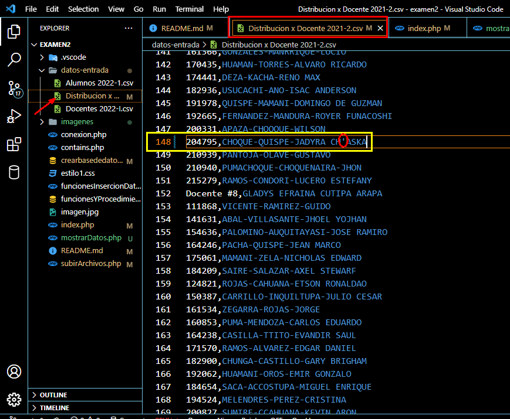 
Se tuvo que borrar esa apóstrofe del nombre ya que producía errores a la hora de subir los datos. 
- No ingresar otra vez los archivos
## Ejecutar el programa xampp control panel
- Escribir en el buscador de windows: xampp control panel y ejecutar 
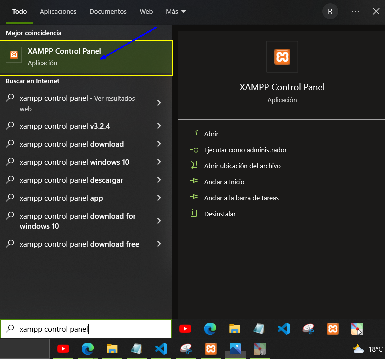 
- En la ventana emergente realizar lo siguiente 
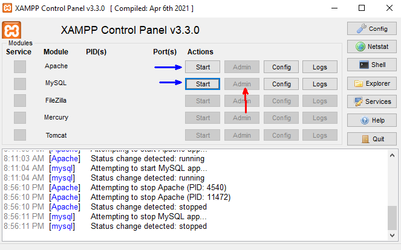 
Inicializar el servidor apache y mysql (start).
Luego, abrir el administrador (admin) de mysql cuando se habilite.
- Desde el phpmyadmin importar el archivo crearbasdedatos.sql 
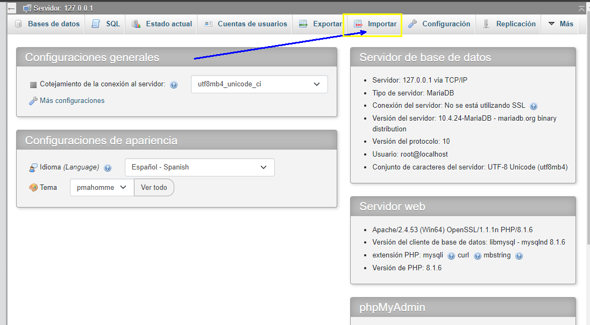
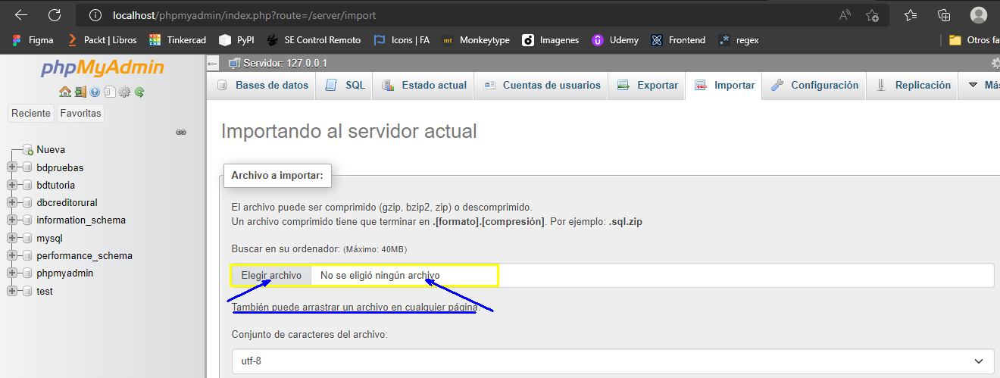
Delizarse en el menú hasta llegar a la parte inferior 
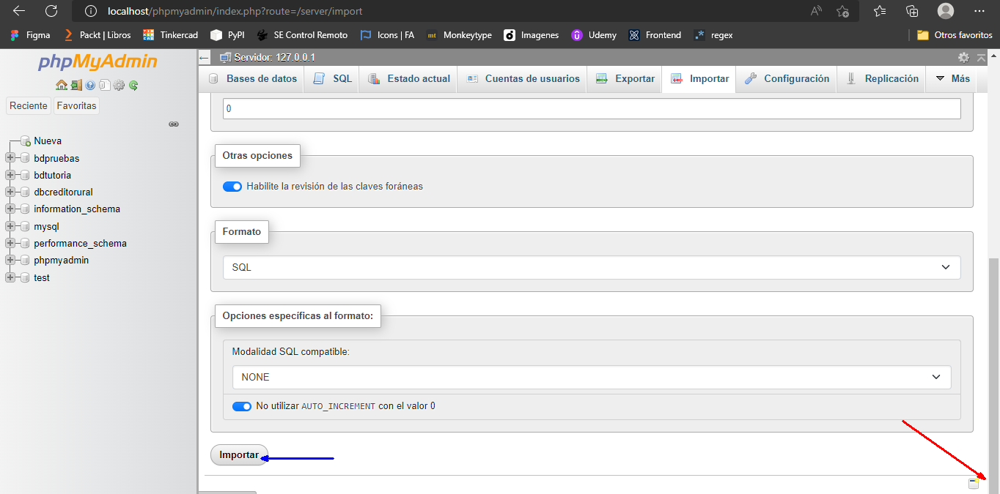
Verificar que se haya creado correctamente la base de datos 
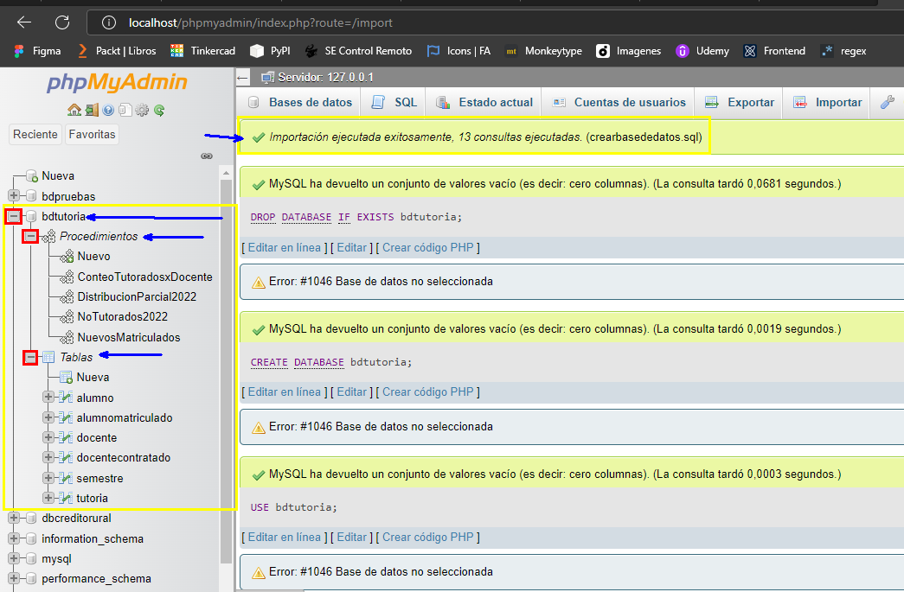
## Uso de la interfaz
- Ejecutar el index desde el navegador de su preferencia 
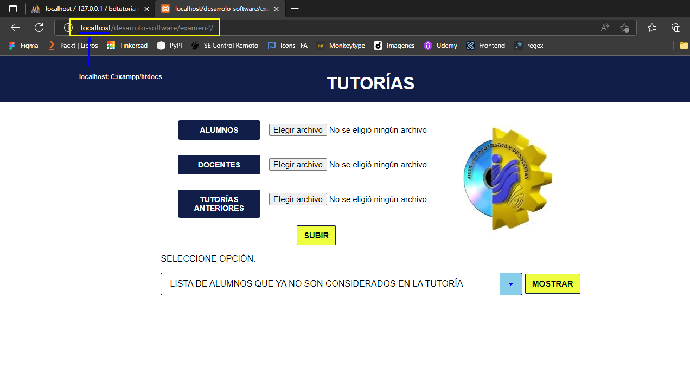
- Escoger los 3 archivos en el lugar correspondiente 
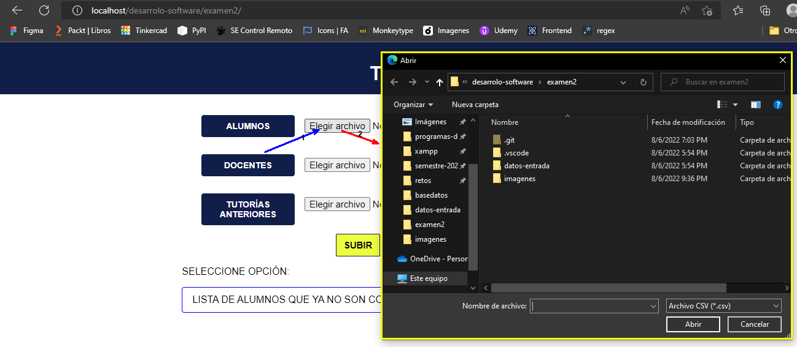
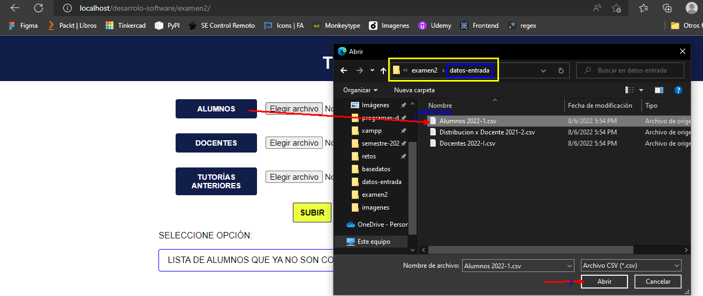
Antes de subir almacenar los datos, asegurarse de tener la siguiente estructura 
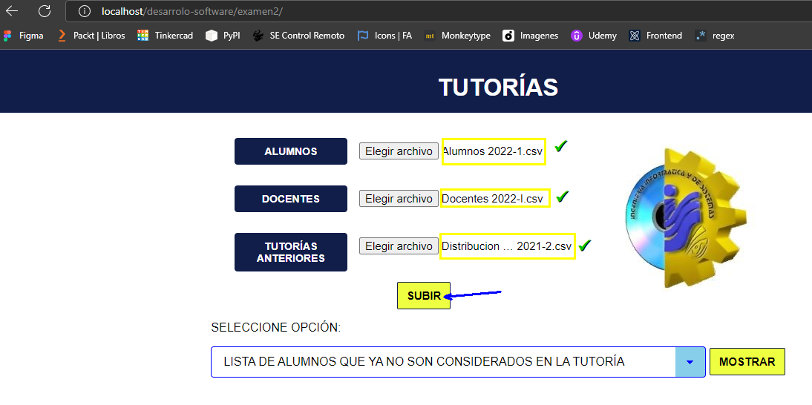
Ya está todo listo para mostrar los resultados
- Mostrar los datos que desee